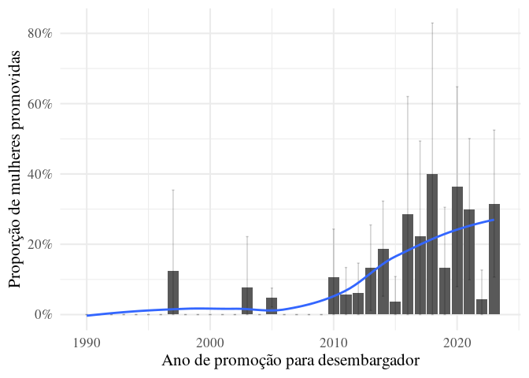
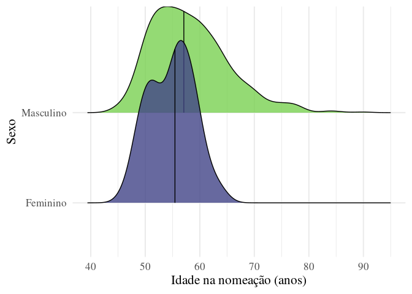
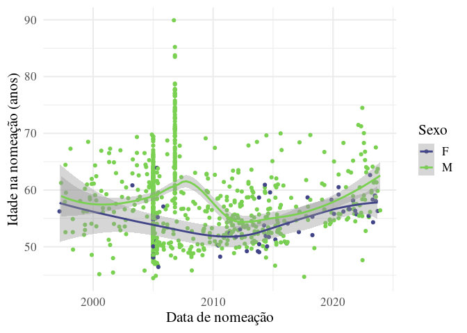

# Glass Ceiling no Judiciário e Políticas de Gênero: Evidência Empírica
a Partir de Modelos Jurimétricos e de Inteligência Artificial

## Leitura dos dados

## Base auxiliar

## Nomeadas por década

| Década da nomeação | Mulheres   | Homens      | Total        |
|:-------------------|:-----------|:------------|:-------------|
| entre 1997 e 1999  | 1 (4.0%)   | 24 (96.0%)  | 25 (100.0%)  |
| entre 2000 e 2009  | 13 (2.8%)  | 459 (97.2%) | 472 (100.0%) |
| entre 2010 e 2019  | 25 (11.8%) | 186 (88.2%) | 211 (100.0%) |
| 2020 ou depois     | 17 (23.3%) | 56 (76.7%)  | 73 (100.0%)  |

## Nomeadas por ano

## Idade de nomeação – distribuição

    # A tibble: 1 × 10
      estimate estimate1 estimate2 statistic    p.value parameter conf.low conf.high
         <dbl>     <dbl>     <dbl>     <dbl>      <dbl>     <dbl>    <dbl>     <dbl>
    1    -3.40      54.8      58.2     -5.57    3.31e-7      80.5    -4.61     -2.18
    # ℹ 2 more variables: method <chr>, alternative <chr>

## Idade de nomeação – dispersão

## Local de origem (dados utilizados no texto)

## Faculdade de direito (dados utilizados no texto)

## Juiz substituto (dados utilizados no texto)

## Quinto constitucional (dados utilizados no texto)

## Quinto constitucional – atual (dados utilizados no texto)

## Quinto constitucional – histórico

| % Quinto - Mulheres | % Quinto - Homens   | Diferença | IC da diferença |   p-valor |
|:--------------------|:--------------------|:----------|:----------------|----------:|
| 18 de 56 (32.14%)   | 115 de 725 (15.86%) | 16.28%    | 2.8%–29.8%      | 0.0032996 |

## Promotoria (dados utilizados no texto)
