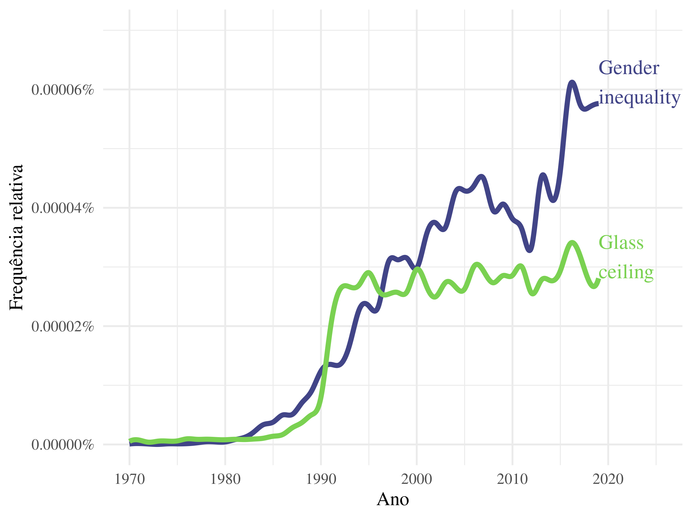

# Análise Ngram

Para realizar essa análise, utilizamos o pacote `ngramr` para buscar a
frequência de termos em livros do Google Books. O pacote `ngramr` é uma
interface para a API do Google Ngram Viewer, que permite buscar a
frequência de termos em livros do Google Books.

Os termos pesquisados foram “glass ceiling” e “gender inequality”. Os
resultados foram pesquisados a partir do ano de 1970, e nenhum tipo de
suavização foi aplicado, já que a suavização foi calculada diretamente
pelo R.

``` r
termos <- c(
  "glass ceiling",
  "gender inequality"
)

da <- ngramr::ngram(termos, smoothing = 0, year_start = 1970) |>
  janitor::clean_names() |>
  dplyr::mutate(frequency = formattable::comma(frequency, digits = 10))


knitr::kable(rbind(head(da), tail(da)))
```

| year | phrase            |    frequency | corpus  |
|-----:|:------------------|-------------:|:--------|
| 1970 | glass ceiling     | 0.0000000052 | en-2019 |
| 1971 | glass ceiling     | 0.0000000074 | en-2019 |
| 1972 | glass ceiling     | 0.0000000038 | en-2019 |
| 1973 | glass ceiling     | 0.0000000056 | en-2019 |
| 1974 | glass ceiling     | 0.0000000057 | en-2019 |
| 1975 | glass ceiling     | 0.0000000060 | en-2019 |
| 2014 | gender inequality | 0.0000004170 | en-2019 |
| 2015 | gender inequality | 0.0000004627 | en-2019 |
| 2016 | gender inequality | 0.0000006055 | en-2019 |
| 2017 | gender inequality | 0.0000005773 | en-2019 |
| 2018 | gender inequality | 0.0000005699 | en-2019 |
| 2019 | gender inequality | 0.0000005762 | en-2019 |

Em seguida, calculamos a suavização dos dados, utilizando a função
`spline` do pacote `stats`. A suavização foi calculada para 1000 pontos.

``` r
spl <- da |>
  dplyr::group_by(phrase) |>
  dplyr::reframe(as.data.frame(spline(year, frequency, 1000))) |>
  dplyr::mutate(
    phrase = stringr::str_to_sentence(phrase),
    phrase = stringr::str_wrap(phrase, 5)
  )
```

Os resultados foram plotados em um gráfico de linhas, utilizando o
pacote `ggplot2`.

``` r
p <- spl |>
  ggplot2::ggplot() +
  ggplot2::aes(x, y, colour = phrase) +
  ggplot2::geom_line(linewidth = 2) +
  ggplot2::scale_colour_viridis_d(begin = .2, end = .8) +
  ggplot2::scale_y_continuous(
    labels = scales::percent, limits = c(0, 7e-7)
  ) +
  ggplot2::theme_minimal(16, base_family = "serif") +
  ggplot2::geom_text(
    ggplot2::aes(label = phrase),
    hjust = 0, vjust = 0, size = 6, family="serif",
    data = spl |>
      dplyr::filter(x == max(x))
  ) +
  ggplot2::guides(color = "none", label = "none") +
  ggplot2::labs(
    x = "Ano",
    y = "Frequência relativa",
    colour = "Frase"
  ) +
  ggplot2::coord_cartesian(clip = "off", xlim = c(1970, 2025))

p
```


